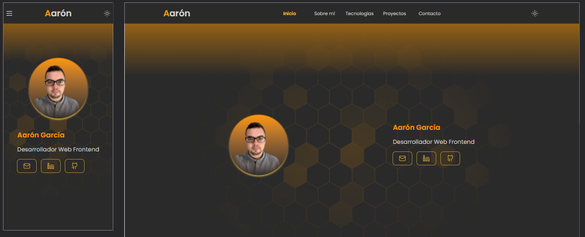

 

  

    
# Personal Porfolio
    

## Links

## Features

- Responsive design adapting to all devices.
- Smooth and modern animations to enhance user experience.
- Functional and accessible contact form.
- Portfolio rating system with registration using Supabase for managing and storing votes.
- Interactive popover to display the email discreetly and securely.

---

## Technologies and Tools Used

- **Languages:** HTML, JavaScript.
- **Frameworks and Libraries:** React, Tailwind CSS.
- **Development Tools:** Vite (bundler), pnpm (package manager), Windsurf (code editor).
- **Environments:** Windows, Node.js.
- **External Services:**
  - [Supabase](https://supabase.com/): backend and data management.
  - [Vercel](https://vercel.com/): deployment and hosting.
  - [FingerprintJS](https://fingerprint.com/): user identification for the rating system.

---

## External Resources and Libraries

- [React](https://reactjs.org/)
- [Tailwind CSS](https://tailwindcss.com/)
- [Supabase](https://supabase.com/)
- [Vercel](https://vercel.com/)
- [FingerprintJS](https://fingerprint.com/)
- [Google Fonts](https://fonts.google.com/)
- [Flowbite](https://flowbite.com/)
- [Lucide React](https://lucide.dev/)
- [@midudev/tailwind-animations](https://tailwindcss-animations.vercel.app/)
- [Web3Forms](https://web3forms.com/)
- [Theme toggle](https://theme-toggle.rdsx.dev/)

