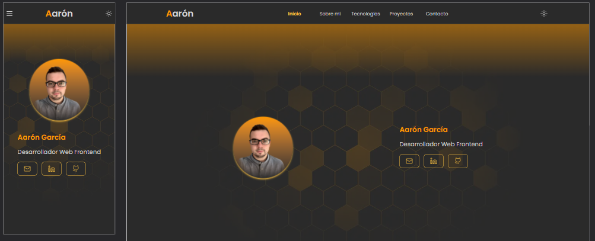

 

  

  
# Portfolio Personal

## Enlaces

## Características

- Diseño responsive adaptado a todos los dispositivos.
- Animaciones suaves y modernas para mejorar la experiencia.
- Formulario de contacto funcional y accesible.
- Sistema de valoración del portfolio con registro en Supabase, que permite gestionar y almacenar votos.
- Popover interactivo para mostrar el correo de forma discreta y segura.

---

## Tecnologías utilizadas

- **Lenguajes:** HTML, JavaScript.
- **Frameworks y librerías:** React, Tailwind CSS.
- **Herramientas de desarrollo:** Vite (empaquetador), pnpm (gestor de paquetes), Windsurf (editor de código).
- **Entornos:** Windows, Node.js.
- **Servicios externos:**
  - [Supabase](https://supabase.com/): backend y gestión de datos.
  - [Vercel](https://vercel.com/): despliegue y alojamiento.
  - [FingerprintJS](https://fingerprint.com/): identificación de usuarios para el sistema de valoración.

---

## Recursos y librerías externas

- [React](https://reactjs.org/)
- [Tailwind CSS](https://tailwindcss.com/)
- [Supabase](https://supabase.com/)
- [Vercel](https://vercel.com/)
- [FingerprintJS](https://fingerprint.com/)
- [Google Fonts](https://fonts.google.com/)
- [Flowbite](https://flowbite.com/)
- [Lucide React](https://lucide.dev/)
- [@midudev/tailwind-animations](https://tailwindcss-animations.vercel.app/)
- [Web3Forms](https://web3forms.com/)
- [Theme toggle](https://theme-toggle.rdsx.dev/)